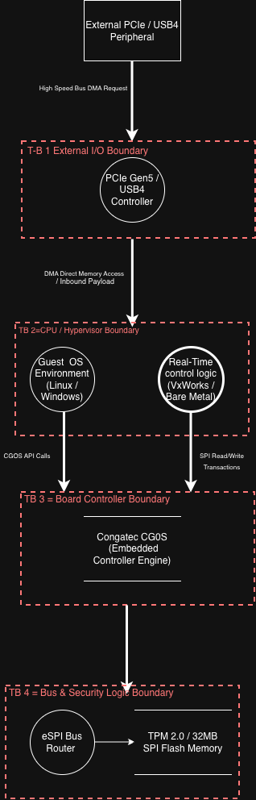

#  Hardware/Software Threat Model


This repository demonstrates a **Docs-as-Code** approach to threat modeling for embedded hardware targets. It models the **congatec COM-HPC Mini** ecosystem across four core trust boundaries.

## System Threat Model Diagram



---

## Threat Matrix & Compliance

For the complete STRIDE threat analysis mapped against **OWASP ASVS**, **NIST SP 800-53/161**, **ISO/IEC 27001**, and **IEC 62443**, view the full document:
[`docs/security/stride-matrix.md`](./docs/security/stride-matrix.md)

---

## CI/CD Validation

This repository includes automated GitHub Actions workflows:

* **`.github/workflows/ci.yml`**: Validates Markdown quality/syntax and executes local acceptance test scripts located in `src/`.
* **`.github/workflows/security-ci.yml`**: Runs Trivy Software Composition Analysis (SCA) to scan dependencies and upload SARIF security alerts under **IEC 62443-4-1** guidelines.

---

## Local Execution

You can run the driver permission test script locally on Linux:

```bash
chmod +x src/cgos_access_check.sh
./src/cgos_access_check.sh< Testing PR Template -->
